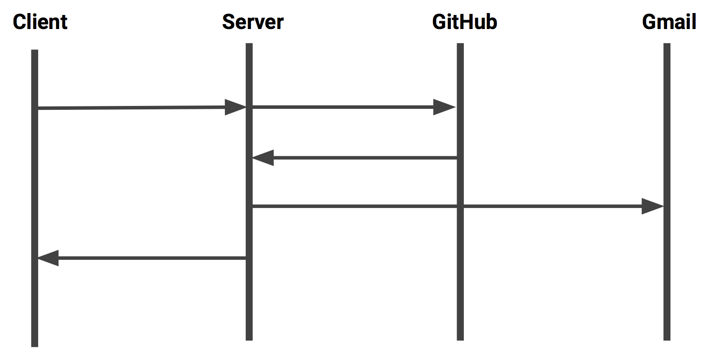
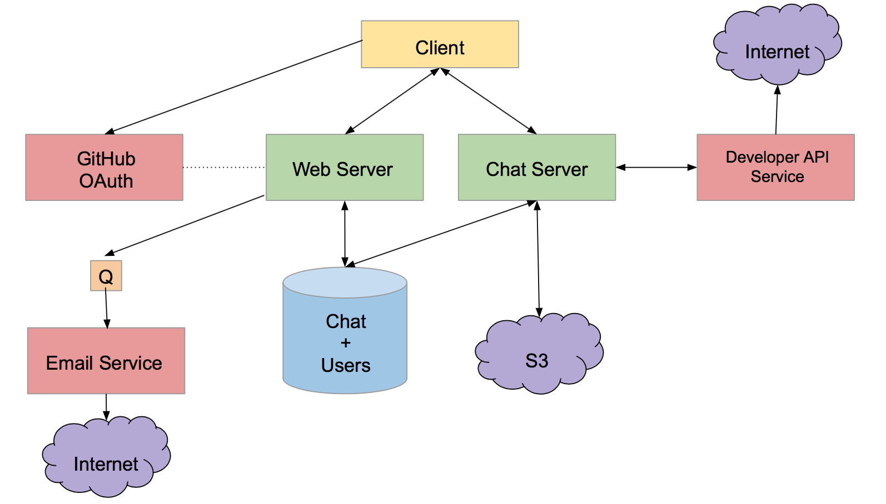

# [GitTalk](http://gittalk.co)
> Slack Clone for Github Users


## What is it?

GitTalk is a Slack clone built for Github users, which allow discussion/correspondence rooms to be created rapidly for the public Github repos that developers are part of. The platform also gives users an API to create third-party bots/applications that interact with GitTalk users.

## Table of Contents

1. [Usage](#Usage)
2. [Requirements](#requirements)
3. [Development](#development)
    a. [Tech Stack](#tech-stack)
    b. [Sequence Diagram](#sequence-diagram)
4. [Team](#team)
5. [Contributing](#contributing)

## Usage

Go to [gittalk.co](http://gittalk.co) and start using our application using your Github user id.

## Requirements

Application was developed and tested for Google Chrome on the desktop/laptop.

## Development

Contribute to the application by making a pull request!

### Tech Stack

The application was built using the MongoDB, Express, React, Node (MERN) stack, incorporating the following technologies:
- AWS + Docker
- Email Integration
- Github API
- Markdown Text Editor
- Redux
- S3 Image Upload
- Socket.io

### Sequence Diagram



### System Architecture



### Installing Dependencies

From the directory which you wish to place the development files:

```sh
git clone https://github.com/StetsonAvalanche/GitTalk.git 
```

From within the root directory:

```sh
npm install
npm run start-dev
```

### Roadmap

View the project roadmap [here](https://github.com/StetsonAvalanche/GitTalk/issues)

## Team

This application is created and developed by [Afsoon Nicknam](https://github.com/anicknam), [Chase Starr](https://github.com/chasestarr), [Felicia Fong](https://github.com/f-fong), and [Tony Tan](https://github.com/tankwan).

## Contributing

See [CONTRIBUTING.md](CONTRIBUTING.md) for contribution guidelines.
